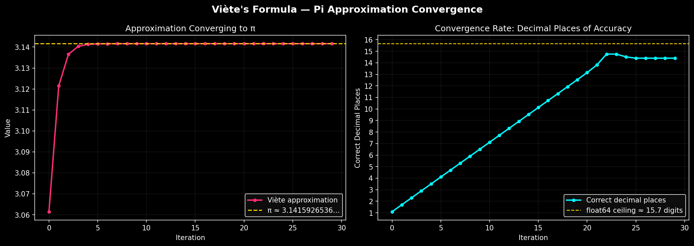

# Approximating π with Viète's Formula

François Viète published this in 1593 — the **first infinite product formula in the history of mathematics**:

```
         2     2           2                2
π = 2 · ─── · ──────── · ──────────── · ──────────────── · ···
        √2   √(2+√2)   √(2+√(2+√2))  √(2+√(2+√(2+√2)))
```

Each denominator is built by nesting one more square root. The partial products converge to π from below, getting closer with every term.

---

## The Script

[approx.py](approx.py) iterates the Viète recurrence, tracking the approximation and how many decimal places of π are correct at each step. Two plots are produced:

- **Left** — the approximation value closing in on π, shown over the first 30 iterations where all the action happens
- **Right** — correct decimal places per iteration, revealing the linear convergence rate and where it slams into the float64 ceiling at ~15.65 digits

Run it with:

```bash
venv/bin/python approx.py
```



---

## Why It Converges: The Taylor Series Argument

### The Closed Form

The nth partial product has a beautiful closed form. By telescoping the identity `sin(x) = 2 sin(x/2) cos(x/2)` n times you get:

```
Vₙ = 2ⁿ⁺¹ · sin(π / 2ⁿ⁺¹)
```

This is not obvious from looking at the nested radicals, but it means the entire infinite product collapses into a single trigonometric expression.

### The Error Formula

Let `θₙ = π / 2ⁿ⁺¹`. As n grows, θₙ → 0, and we can Taylor-expand sin:

```
sin(θ) = θ − θ³/6 + θ⁵/120 − ···
```

So:

```
Vₙ = (π/θₙ) · sin(θₙ) = π · (1 − θₙ²/6 + θₙ⁴/120 − ···)
```

Subtracting from π:

```
π − Vₙ ≈ π · θₙ²/6
        = π · (π / 2ⁿ⁺¹)² / 6
        = π³ / (6 · 4ⁿ⁺¹)
        = (π³/24) · (1/4)ⁿ
```

This is the convergence law:

```
|π − Vₙ| ≈ C · (1/4)ⁿ      where  C = π³/24 ≈ 1.292
```

The constant `C = π³/24` comes from nothing more than the `1/6` coefficient in the sine Taylor series.

### What This Means

The error shrinks by a factor of **4 every iteration**. In terms of decimal digits:

```
correct digits ≈ n · log₁₀(4) ≈ n · 0.602
```

This is **linear convergence** — the digit count grows as a straight line. To reach 15 digits you need roughly `15 / 0.602 ≈ 25` iterations, which matches the script's output exactly.

---

## Connection to Archimedes' Polygon Method

The closed form `Vₙ = 2ⁿ⁺¹ sin(π / 2ⁿ⁺¹)` is not a coincidence — it *is* Archimedes, expressed differently.

A regular N-gon inscribed in a **unit circle** (radius = 1) has:

- side length: `2 sin(π/N)`
- full perimeter: `2N sin(π/N)`
- half-perimeter: `N sin(π/N)`

Since the semicircumference of a unit circle is π, this half-perimeter approaches π from below. Setting `N = 2ⁿ⁺¹`:

```
half-perimeter of inscribed 2ⁿ⁺¹-gon  =  2ⁿ⁺¹ sin(π / 2ⁿ⁺¹)  =  Vₙ
```

**Viète's partial product is exactly Archimedes' inscribed polygon formula.** Each loop iteration doubles the number of sides.

Archimedes also derived an upper bound using the *circumscribed* polygon, bracketing π on both sides:

```
N sin(π/N)  <  π  <  N tan(π/N)
  (inscribed)          (circumscribed)
```

Working by hand with 96 sides (n=4 starting from a hexagon), he established:

```
3 + 10/71  <  π  <  3 + 1/7
```

Viète's formula automates the doubling step — the nested radical recurrence is just the half-angle formula for cosine applied to each new polygon side length.

---

## Iterations

The formula evaluated explicitly for the first several n:

| n | Formula | Polygon sides | Value |
|---|---------|:---:|-------|
| 0 | 2¹ sin(π/2) | 2 | 2.0000000000 |
| 1 | 2² sin(π/4) = **2√2** | 4 (square) | 2.8284271247 |
| 2 | 2³ sin(π/8) | 8 (octagon) | 3.0614674589 |
| 3 | 2⁴ sin(π/16) | 16 | 3.1214451523 |
| 4 | 2⁵ sin(π/32) | 32 | 3.1365484905 |
| 5 | 2⁶ sin(π/64) | 64 | 3.1403311570 |
| 6 | 2⁷ sin(π/128) | 128 | 3.1412772509 |

π = 3.14159265358979…

The script starts with `approx = 2*(2/√2) = 2√2`, which is n=1 (the square). The loop then runs from n=2 onwards.

---

## Comparison: Gauss-Legendre Algorithm

For contrast, the **Gauss-Legendre algorithm** uses the arithmetic-geometric mean (AGM) iteration:

```
a₀ = 1,  b₀ = 1/√2,  t₀ = 1/4,  p₀ = 1

a_{n+1} = (aₙ + bₙ) / 2
b_{n+1} = √(aₙ · bₙ)
t_{n+1} = tₙ − pₙ(aₙ − a_{n+1})²
p_{n+1} = 2pₙ

π ≈ (aₙ + bₙ)² / (4tₙ)
```

This has **quadratic convergence** — correct digits *double* every iteration:

```
n=0 →  ~1 digit
n=1 →  ~2 digits
n=2 →  ~4 digits
n=3 →  ~8 digits
n=4 → ~16 digits  ← hits float64 ceiling
```

Where Viète needs 25 iterations to saturate a 64-bit float, Gauss-Legendre needs 4. On the convergence plot, Viète is a straight line; Gauss-Legendre would be an exponential curve hitting the ceiling almost immediately.
